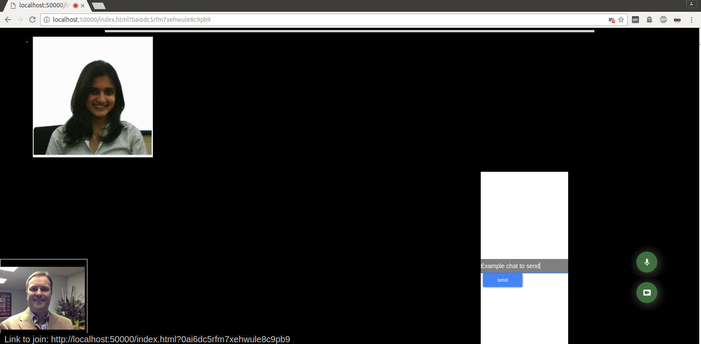

## Incognito Peer to Peer WebRTC encrypted video chat conferencing

Encrypted WebRTC video conferencing app built on Javascript.  Uses peer-to-peer connections for A/V and a centeralized sockets.IO signaling server for command delegation.  Bypasses firewalls and is obfuscation routing network safe (TOR).

## Challenge and Approach

Our approach for satisfying this challenge was to:

- Utilize Javascript and web conferencing technologies with an encrypted network layer to enable secure communications.
- Peer to peer video and audio conferencing utilizes Google's VP8 WebP compression and Opus Audio Codec.
- Peer to peer communications of signaling (muting audio and disabling webcam) and chat uses JSON over communicated over HTTPS websockets

## Technologies, APIs, and Datasets Utilized

We made use of:
- [JavaScript] - WebRTC

## How to run

1) You first need to have node.JS installed
2) Next run npm install to download the appropriate Javascript dependencies
3) Run the server by: node server.js
4) You will have a URL generated for example: http://localhost:50000/

Go to http://localhost:50000 and you will have an instant P2P encrypted video conferencing app

Our code is licensed under the [MIT License](LICENSE.md).
